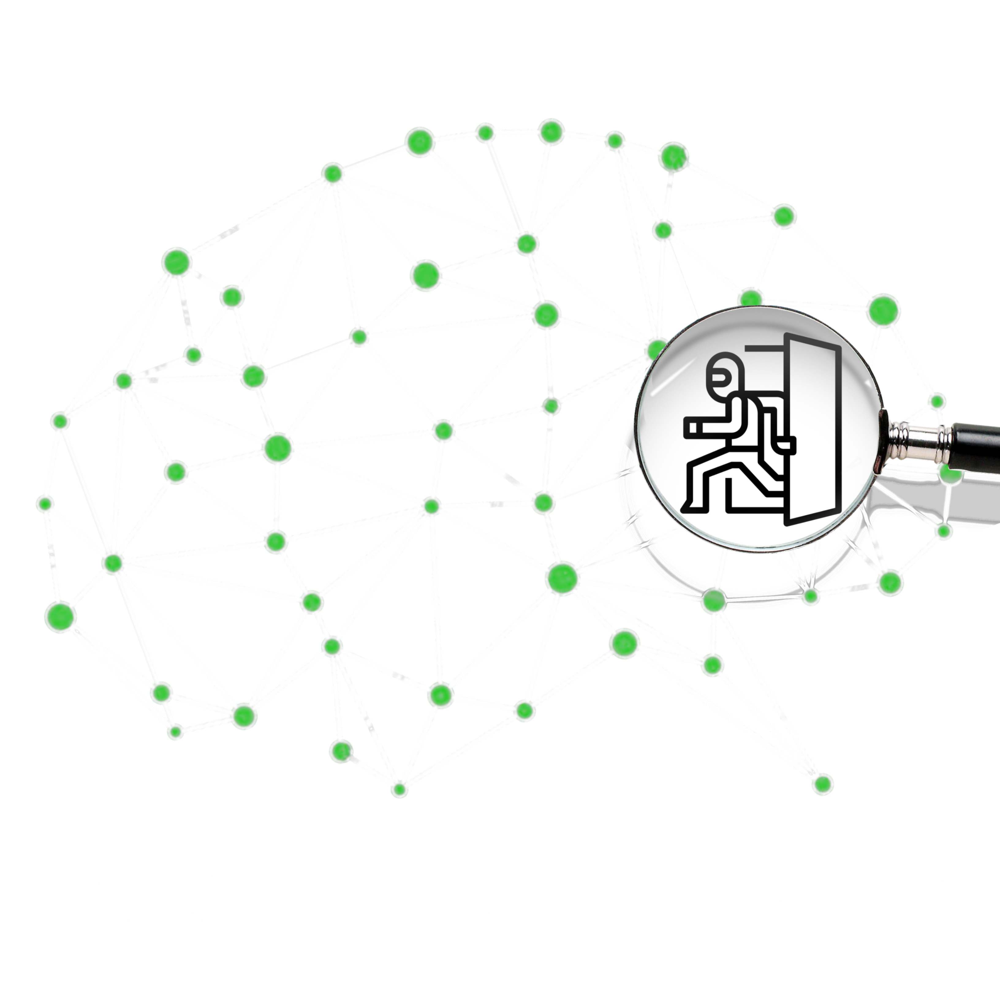

 # Backdoor Snitch
Have you heard about neural trojans or neural backdoors?
Imagine this: what if an attacker could unlock your phone using his face, without generating any suspicious traffic?  Or what if he could make a self-driving car misclassify a stop sign as a speed limit of 200 km/h without ever accessing the car or its network?

How is that possible?
Any AI system can be vulnerable to neural trojans—malicious behaviors hidden inside a model. These don't affect the model’s normal accuracy, so everything seems fine— until a hidden trigger appears. Then, the model behaves exactly as the attacker intended.
It’s a real **threat**, especially when using third-party models. And currently, there is no tool that can reliably detect advanced backdoor attacks across all model architectures and training datasets—without needing access to the training data.

## That’s where we come in.  
We’ve developed the first generalizable, data-free, and robust software for detecting neural trojans before deployment, and you can also use it after deployment to keep monitoring your model.  
It’s designed to be:  
- Easy to use, with no need for security expertise or advanced AI knowledge.  
- Computationally efficient, and able to run on devices with limited processing power.  
